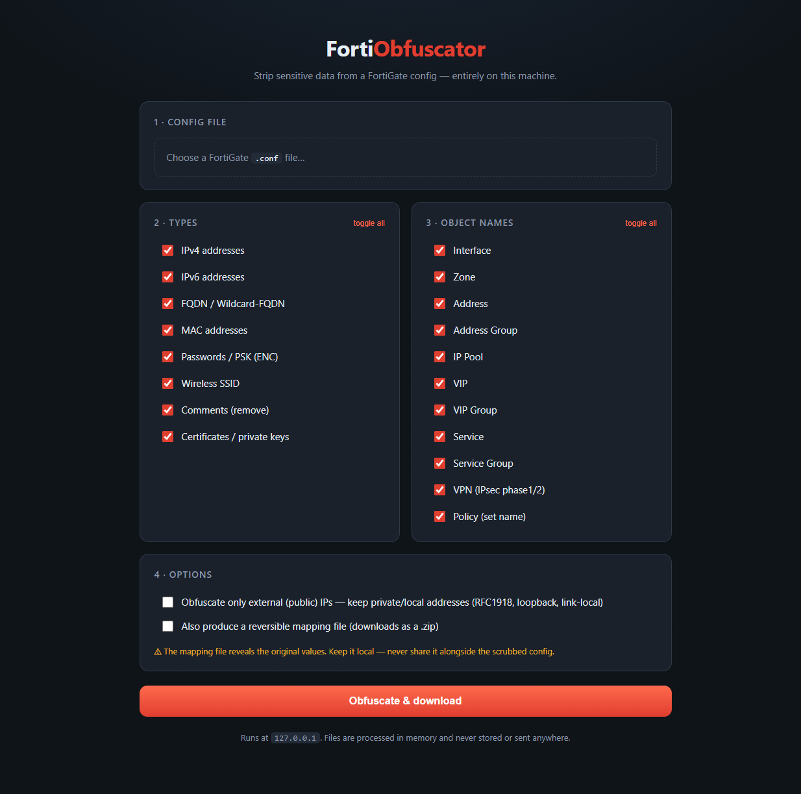

# FortiObfuscator

Strip the sensitive data out of a FortiGate config before you share it. Secrets,
IPs, MACs, FQDNs, SSIDs and every object name get rewritten — consistently, so an
address renamed in its definition is renamed in every policy and group that uses
it, and the file still parses.

FortiOS configs. Pure Python. Runs entirely on your machine — nothing is uploaded.




## Why

Every time someone needs to send a FortiGate config to TAC, a vendor, a forum, or
into a doc, the same chore comes up: scrub the PSKs, the admin password hashes,
the public IPs, the customer's internal naming — by hand, in a few thousand lines,
hoping you didn't miss one. Miss a single `set psksecret` and you've leaked a VPN
key.

This does that pass for you. Point it at a `.conf`, pick what to scrub, and it
rewrites everything **consistently** — the same IP becomes the same fake IP
everywhere, `Web_Server` becomes `ADDR_1` in its definition *and* in every policy
that references it — so the result is safe to share but still reads and parses
like a real config.

It runs locally with no dependencies for the CLI, and a one-command local web UI
if you'd rather click.

## Install

Python 3.10+. The CLI is pure standard library; the web UI needs Flask.

```bash
git clone https://github.com/Sabissimo/fortiobfuscator.git
cd fortiobfuscator

python3 -m venv .venv
source .venv/bin/activate          # Linux / macOS
# .venv\Scripts\activate           # Windows

pip install -r requirements.txt    # only needed for the web UI
python -m webapp.app
```

Open `http://127.0.0.1:5000`. It binds to localhost only — your config is
processed in memory and never written to disk server-side or sent anywhere.

> Just want the command line? Skip the `pip install` — the CLI has **zero
> dependencies**:
> ```bash
> python -m fortiobfuscator.cli config.conf -o config_obfuscated.conf
> ```

### Updating

```bash
git pull
```

That's it — no build step. Make sure your clone's `origin` points at
`github.com/Sabissimo/fortiobfuscator` (`git remote -v`).

## What it obfuscates

Every item below is an independent toggle in both the UI and the CLI.

**Values (global, consistent)**

- **IPv4 / IPv6** — every address (unicast, multicast, private, ranges) →
  consistent fakes. Subnet masks and `0.0.0.0` are left intact. An optional
  **"external IPs only"** mode keeps local/LAN addresses (RFC1918, loopback,
  link-local, ULA) and scrubs only the public ones.
- **FQDN / Wildcard-FQDN** — `set fqdn` / `set wildcard-fqdn` → fake domains
  (the leading `*.` is kept).
- **MAC** — every MAC → a consistent locally-administered fake.
- **Passwords / PSKs** — `ENC <blob>` → `ENC 012345678`.
- **SSID** — `set ssid` → `SSID_n`.
- **Comments** — `set comment` / `set comments` lines removed.
- **Certificates / private keys** — multi-line PEM blocks redacted.

**Object names (renamed everywhere they're referenced)**

Interface · Zone · Address · Address Group · IP Pool · VIP · VIP Group · Service ·
Service Group · VPN (phase1/2 → `VPN_`, interface phases → `VPN_INTF_`) · Policy
(`set name`).

Each becomes `PREFIX_n` (`ADDR_1`, `INTERFACE_2`, `POLICY_1`, …). Default and
reserved names — `port1`, `wan1`, `dmz`, `all`, `any`, `ALL` — are never touched.

## Using it

**Web UI** — `python -m webapp.app`, then tick the categories and hit *Obfuscate
& download*. Under *Options* you can choose *"external IPs only"* (keep
LAN/private addresses) and *"produce a reversible mapping file"* — the latter
gives a `.zip` with the scrubbed config, the `original → replacement` map, and a
summary.

**CLI**

```bash
# scrub everything
python -m fortiobfuscator.cli config.conf -o out.conf

# summary + reversible mapping (keep the map local!)
python -m fortiobfuscator.cli config.conf -o out.conf -m map.json --summary

# turn categories off
python -m fortiobfuscator.cli config.conf -o out.conf --no-ipv6 --no-comment --no-policy

# scrub only external (public) IPs, keep LAN/private addresses
python -m fortiobfuscator.cli config.conf -o out.conf --public-ips-only

# stdin → stdout
cat config.conf | python -m fortiobfuscator.cli - > out.conf
```

`python -m fortiobfuscator.cli --help` lists every `--no-<category>` flag.

**Library**

```python
from fortiobfuscator import obfuscate, Options
res = obfuscate(open("config.conf").read(), Options.all_enabled(emit_mapping=True))
res.text            # scrubbed config
res.report.as_dict()  # what changed
res.mapping         # original -> replacement
```

The mapping file makes a run **reversible** — and so it reveals every original
value. Keep it strictly local; never ship it next to the scrubbed config.

## Honest caveats

- FortiOS is huge and shifts between versions. The known secret-bearing fields and
  object types are covered, but an exotic field this tool doesn't know about could
  slip through. **Eyeball the output before you share it.** Adding a field is a
  one-line change in `rules.py` — see [docs/EXTENDING.md](docs/EXTENDING.md).
- Only `set comment` / `set comments` lines are removed. Free-text like
  `set description` is left intact by design.
- IPs are mapped per unique address; subnet *relationships* aren't preserved
  (validity and structure are). If you need topology-faithful remapping, open an
  issue.

## Contributing

Adding a category or value type is almost entirely a data edit in `rules.py` — it
then shows up in the CLI and UI automatically. See
[docs/EXTENDING.md](docs/EXTENDING.md), and [CLAUDE.md](CLAUDE.md) /
[docs/ARCHITECTURE.md](docs/ARCHITECTURE.md) for the design. Tests:
`python -m pytest tests/ -q`.

## License

MIT — use it, fork it, ship it.

## Architecture

`config text` → **pass 1** (`parser.collect_object_names`: stack-walk the
`config`/`edit` tree → name map) → **pass 2** (`engine.obfuscate`: ordered
per-line rewrite via regexes + `MappingStore`) → scrubbed text (+ optional JSON
map). Rules are data in `rules.py`; the CLI and web UI derive their toggles from
it. Full write-up in [docs/ARCHITECTURE.md](docs/ARCHITECTURE.md).
